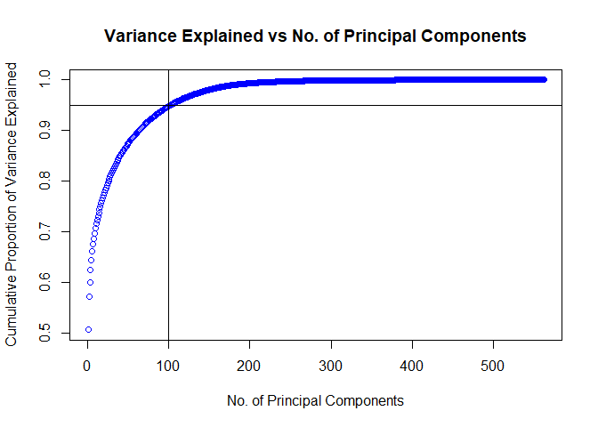

UCI Human Activity Recognition
================

``` r
fileUrl <- "https://d396qusza40orc.cloudfront.net/getdata%2Fprojectfiles%2FUCI%20HAR%20Dataset.zip"
if(!file.exists("UCI HAR Dataset.zip")){
  download.file(fileUrl, destfile = "UCI HAR Dataset.zip", method ="curl")
  unzip("UCI HAR Dataset.zip")
}
# Remove Inertial Signals files
file.remove(list.files("./UCI HAR Dataset/test/Inertial Signals", full.names = TRUE))
```

    ## logical(0)

``` r
file.remove(list.files("./UCI HAR Dataset/train/Inertial Signals", full.names = TRUE))
```

    ## logical(0)

``` r
list.files("./UCI HAR Dataset/", recursive = TRUE)
```

    ##  [1] "activity_labels.txt"     "features.txt"           
    ##  [3] "features_info.txt"       "README.txt"             
    ##  [5] "test/subject_test.txt"   "test/X_test.txt"        
    ##  [7] "test/y_test.txt"         "train/subject_train.txt"
    ##  [9] "train/X_train.txt"       "train/y_train.txt"

``` r
# Load training files into environment
trainfiles <- list.files("./UCI HAR Dataset/train", pattern = ".txt")
for(i in seq_len(length(trainfiles))){
        file <- read.delim(paste0("./UCI HAR Dataset/train/",trainfiles[i]), sep = "")
        name <- gsub(".txt", "", trainfiles[i])
        assign(name, file)
        rm(name); rm(file)
}
# Load test files into environment
testfiles <- list.files("./UCI HAR Dataset/test", pattern = ".txt")
for(i in seq_len(length(testfiles))){
        file <- read.delim(paste0("./UCI HAR Dataset/test/",testfiles[i]), sep = "")
        name <- gsub(".txt", "", testfiles[i])
        assign(name, file)
        rm(name); rm(file)
}

# Create col names to match features first to build dataframe in the correct order
features <- read.delim("./UCI HAR Dataset/features.txt", 
               sep = " ", header = FALSE)
features <- as.vector(features[,2])
col_names <- c("Subject", "Activity", features)
# Create training dataframe
train_data <- data.frame(subject_train, y_train, X_train)
rm(subject_train, y_train, X_train)
colnames(train_data) <- col_names
# Create test dataframe
test_data <- data.frame(subject_test, y_test, X_test)
rm(subject_test, y_test, X_test)
colnames(test_data) <- col_names

# Replace activity code with label
activities <- read.delim("./UCI HAR Dataset/activity_labels.txt", 
                         sep = " ", header = FALSE)
activities <- as.vector(activities[,2])
train_data$Activity <- sapply(train_data$Activity, 
                               function(x){activities[x]})
test_data$Activity <- sapply(test_data$Activity, 
                               function(x){activities[x]})

#Applying nameing transformation to entire dataset
nameVec <- make.names(names(train_data),unique=TRUE)
names(train_data) <- nameVec
nameVec <- make.names(names(test_data),unique=TRUE)
names(test_data) <- nameVec
```

``` r
dim(train_data)
```

    ## [1] 7351  563

``` r
dim(test_data)
```

    ## [1] 2946  563

``` r
# Perform Principal Components Analysis on training data
# must exclude 2nd column 'activity'
pca <- prcomp(train_data[,-2], scale=TRUE)
# Calculate variance from squaring standard deviation
pca.var <- pca$sdev^2
# Calculate proportion of variance explained
pca.pvar <- pca.var/sum(pca.var)

# Plot Cumulative Proportion of Variance Explained
library(ggplot2)
```

    ## Warning: package 'ggplot2' was built under R version 4.0.2

``` r
plot(cumsum(pca.pvar),xlab="No. of Principal Components", ylab="Cumulative Proportion of Variance Explained",main="Variance Explained vs No. of Principal Components",col="blue")
# Show 95% of the Variance explained by first 100 Principal Components
abline(h=0.95, v=100)
```

<!-- -->

``` r
# Select first 100 Principal Components
train.data<-data.frame(activity=train_data$Activity,pca$x)
train.data<-train.data[,1:100]

# Load library for SVM
library(e1071)
```

    ## Warning: package 'e1071' was built under R version 4.0.2

``` r
# Training our SVM Model
# Requires factorisation of 'activity' and specifying 'Classification' type for SVM
train.data$activity <- as.factor(train.data$activity)
svm_model <- svm(activity ~ ., data=train.data, type = "C")

# Prepare test_data for modelling with PCA, i.e. subset to 100 1st PCs
test.data <- predict(pca, newdata = test_data)
test.data <- as.data.frame(test.data)
test.data <- test.data[,1:100]

# Apply trained SVM model to test data
result <- predict(svm_model, test.data, type = "class")
```

``` r
# Generate Confusion Matrix
test.data$Activity = test_data$Activity
references <- test.data$Activity
cm <- table(references,result)
cm
```

    ##                     result
    ## references           LAYING SITTING STANDING WALKING WALKING_DOWNSTAIRS
    ##   LAYING                534       0        0       0                  3
    ##   SITTING                 4     419       63       0                  4
    ##   STANDING                0      29      499       1                  2
    ##   WALKING                 0       0        0     477                 19
    ##   WALKING_DOWNSTAIRS      0       0        0       3                409
    ##   WALKING_UPSTAIRS        0       0        0      21                 23
    ##                     result
    ## references           WALKING_UPSTAIRS
    ##   LAYING                            0
    ##   SITTING                           1
    ##   STANDING                          0
    ##   WALKING                           0
    ##   WALKING_DOWNSTAIRS                8
    ##   WALKING_UPSTAIRS                427

``` r
#Calculating Accuracy from confusion matrix
# Accuracy = sum of diagonals (true positives)/ total
Accuracy <- (cm[1,1]+cm[2,2]+cm[3,3]+cm[4,4]+cm[5,5]+cm[6,6])/sum(cm)
AccuracyRate <- Accuracy*100
c("Accuracy",AccuracyRate)
```

    ## [1] "Accuracy"         "93.8560760353021"

# References

UCI ML Human Activity Recognition Dataset \> Anguita, Alessandro Ghio,
Luca Oneto, Xavier Parra and Jorge L. Reyes-Ortiz. A Public Domain
Dataset for Human Activity Recognition Using Smartphones. 21th European
Symposium on Artificial Neural Networks, Computational Intelligence and
Machine Learning, ESANN 2013. Bruges, Belgium 24-26 April 2013.

[Kaggle Notebook by shikhardhwaj on SVM analysis of cleaned
dataset](https://www.kaggle.com/shikhardhwaj/human-activity-recognition-using-smartphone)
